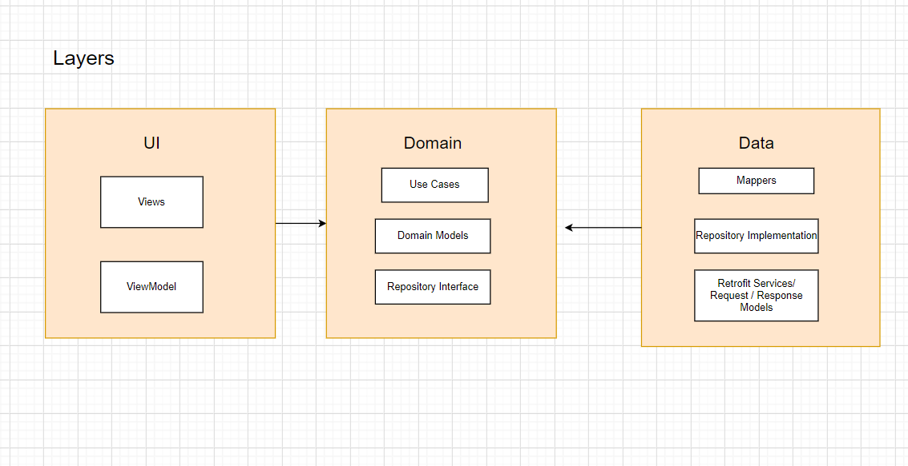

# About StarWarsDemo App
Hey there 👋🏾 ,
In this project I tried showcasing how to build an Android Application with clean architecture and MVVM using some of the jetpack libraries with Kotlin Coroutines & Hilt. This App is using the [Star Wars API](https://swapi.dev/) as a remote data source.

This side Project was initially a case study given to me as a challenge for an android role.

You can check out my thought process in this [file](https://github.com/Hoossayn/StartwarsDemo/blob/main/process.md)

 

# Screenshots

  

# Project Architecture
### Communication between layers
1. UI calls method from ViewModel.
2. ViewModel executes Use case.
3. Use case executes one or multiple Repository function.
4. The Repository returns data from one or multiple Data Sources. the repository is the single source of truth
5. Information flows back to the UI where we display the data fetched from data sources.

I made a diagram to show the flow of the data between the three layers(data, domain , presentation)

# Project Structure
* Data
    * This is my data layer and consisted of the Network related classes including the StarWarsServices interface, and the Repository class as well as
    the local and remote data sources
* Domain
    * This is the domain layer and consists of the domain model as well as the domain mapper
* UI
    * This is the presentation layer. I have set up packages by feature here. This consists of the view related code.
* DI
    * This is where Dagger-hilt related code lives ,connected to the different layers of the application
* Utils
    * This is where most extension functions and constants and some other utils functions exist.

Libraries Used
---------------
* [ViewModel](https://developer.android.com/topic/libraries/architecture/viewmodel) - store and manage UI-related data in a lifecycle conscious way
* [StateFlow](https://developer.android.com/kotlin/flow/stateflow-and-sharedflow) - enable flows to optimally emit state updates and emit values to multiple consumers..
* [ViewBinding](https://developer.android.com/topic/libraries/view-binding) - write code that interacts with views more easily
* [Material](https://material.io/develop/android/docs/getting-started/) - Material Components.
* [Coroutine](https://github.com/Kotlin/kotlinx.coroutines#user-content-android) - performs background tasks
* [Flows](https://kotlin.github.io/kotlinx.coroutines/kotlinx-coroutines-core/kotlinx.coroutines.flow/-flow/) - for asynchronous data streams
* [Retrofit2](https://square.github.io/retrofit/)- networking
* [Gson](https://github.com/google/gson) - JSON Parser
* [Dagger-hilt](https://dagger.dev/hilt/) - dependency injector
* [Stetho](http://facebook.github.io/stetho/) - debug bridge
* [Junit](https://junit.org/junit4/) - unit tests
* [Truth](https://github.com/google/truth) - Makes your test assertions and failure messages more readable

# Nice to have 
* show search history in search screen
* extract folders to thier own modules
* ci - github action
* ui test 

 
